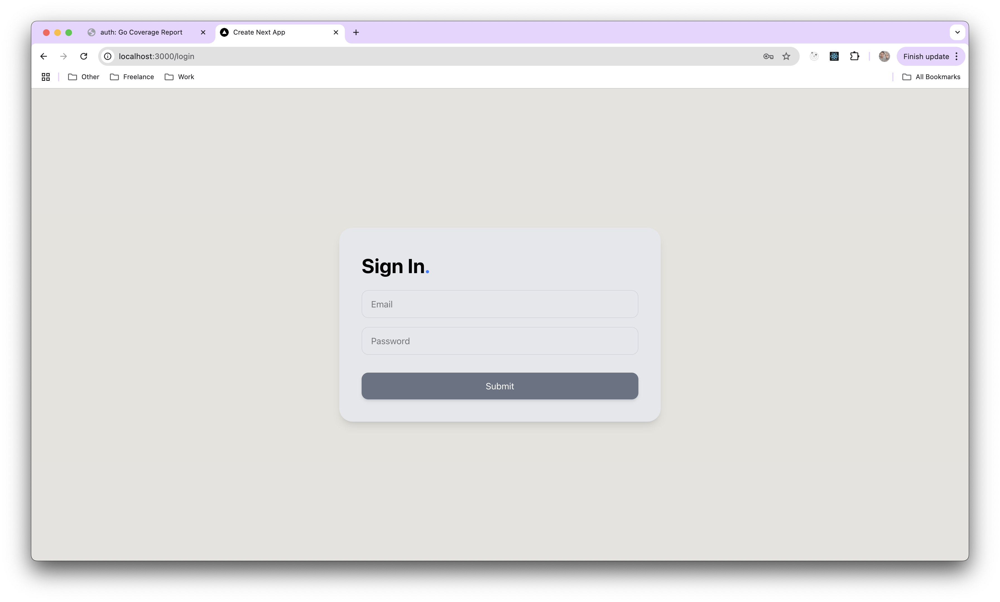
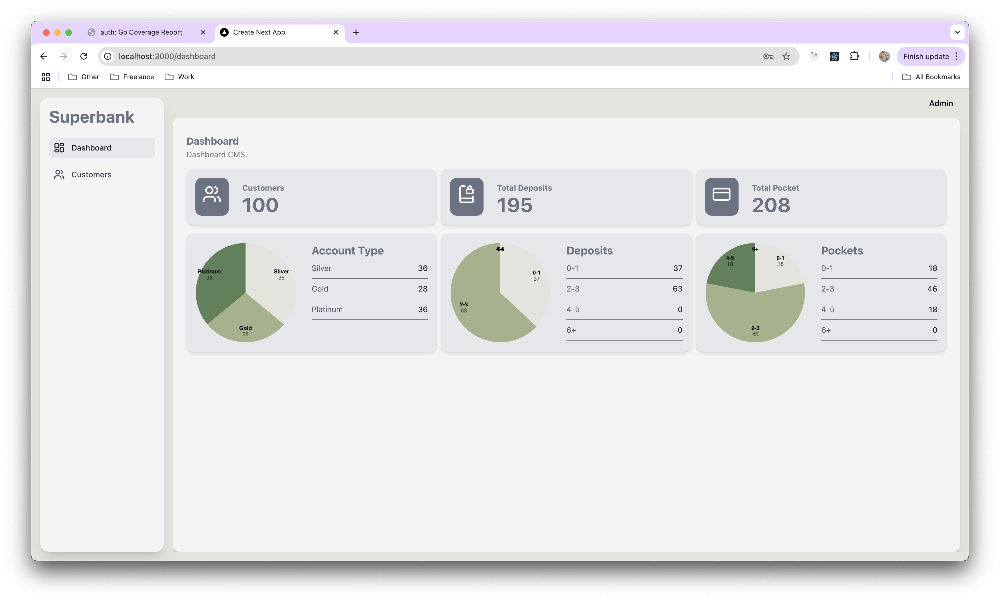
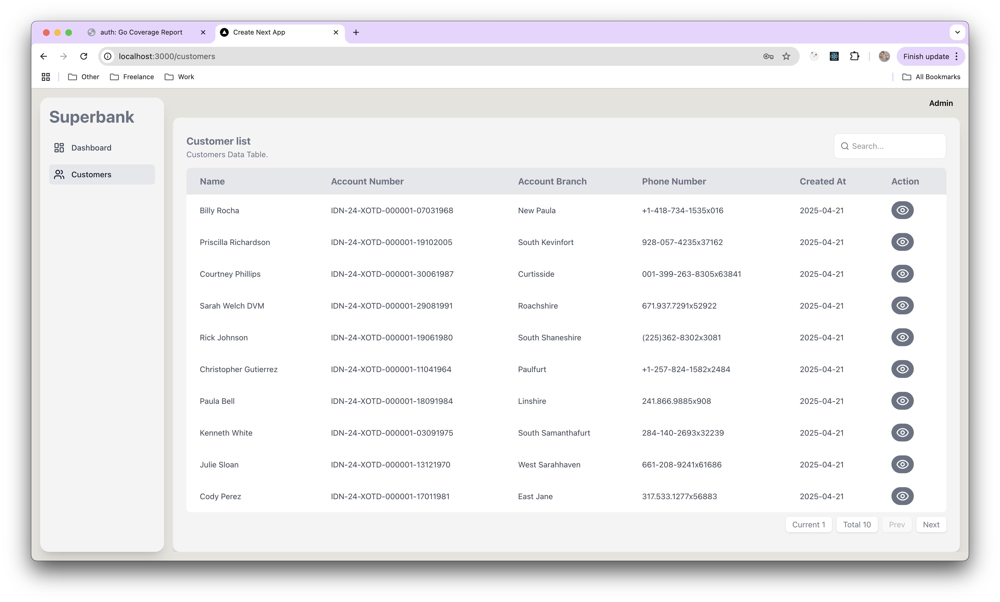
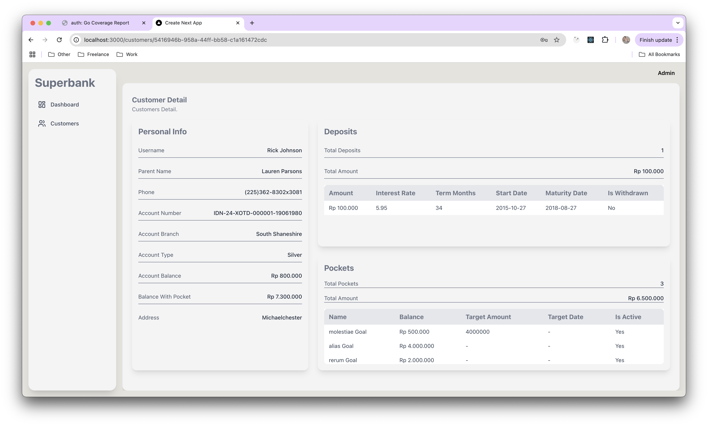

## SIGN IN


```
1. Email & Password Input
	- Email: to enter the user's email address.
	- Password: to enter a password.
	- Its function: to collect user credentials.

2. Submit button
	- An event occurs that performs the authentication function.
	- The data from the email and password input is sent to the backend server.
```

## DASHBOARD


```
This dashboard is used to provide an overview and summary statistics related to customer activities and data in the bank system, namely:
1. Monitoring Number of Customers and Activities
	- Displays the total number of Customers, Deposits, and Pockets in the system.
2. Account Type Analysis
	- Pie chart and table showing customer distribution based on Account Type (Silver, Gold, Platinum).
3.	Distribution of Deposits per Customer
	- Displays the number of customers who have deposits within a certain range (e.g. 0-1, 2-3, etc.).
	- It is useful to see the saving habits of customers.
4.	Distribution of Pockets per Customer
	- Same as deposits.
```

## CUSTOMER LIST


```
This page is used to display a list of all customers in the form of an interactive table. Its functions include:
1.	Display Important Customer Data
	- Name
	- Account Number
	- Branch (Account Branch)
	- Phone Number
	- Date of Registration (Created At)
2.	View Detail Action
	- “View” button on each row to see the full details of the customer.
3.	Quick Search
	- Search field on the top right to filter the customer list by name or account number data.
4.	Pagination
	- Navigation below the table to move between data pages if the number of customers is more than 10.
```

## CUSTOMER DETAIL


```
This page is used to view full details of customer data, including:
1. Personal Info
	- Username and parent's name
	- Phone number
	- Account and branch number
	- Account type and current balance
	- Total balance including pockets
	- Customer's address

2. Deposits
	- Total number of deposits and total amount of money
	- Details of each deposit: amount, interest, tenor, start date, due date, and withdrawal status

3. Pockets
	- Goal name, current balance, target balance, target date and active status
```